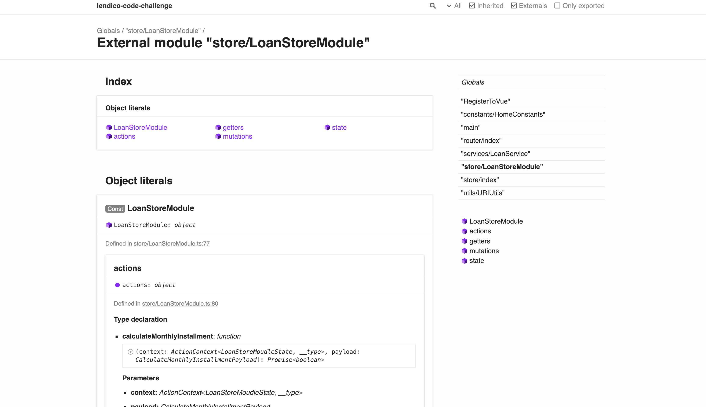

# lendico-code-challenge


## Project setup
```
npm install
```
---
### Compiles FE and BE to run on local
```
npm run rest-server
```
---
### Compiles and minifies FE for production
```
npm run build
```
---

### Run your unit tests
```
npm run test:unit
```
---
### Lints and fixes files
```
npm run lint
```
---

### Start Vue project Manager
```
npm run vpm-start
```
---

### Start storybook
```
npm run storybook
```
---

### See FE Documentation
```
Open file <root>/docs/code/index.html  in Web  Browser
```
---
### Customize configuration
See [Configuration Reference](https://cli.vuejs.org/config/).
